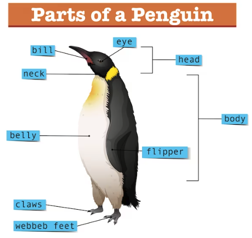
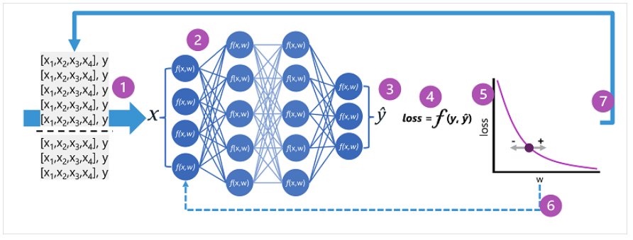
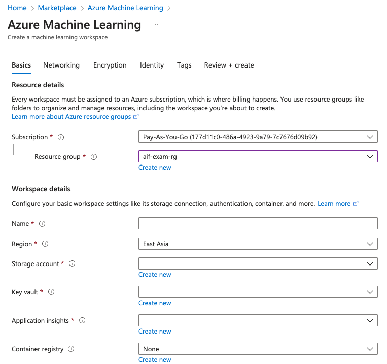

# fundamental AI concepts

## introduction to AI
what? AI is software that imitate human behaviors and capabilities. key workload include:
- machine leaning; teach a computer model to make predictions and draw conclusions from data
- computer vision; interpret the world visually through cameras, video, and images
- nlp; interpret written and spoken language, and respond in kind.
- doc intelligence; manage, process, and use high volume of data found in forms and docs
- knowledge mining; extract info from large volumes of often unstructured data to create a searchable knowledge store. 
- gen ai; create origin content in a variety of formats including natural language, image, code, and more.

## understand machine learning

### how machine learning works
data scientist can use all of that data to train machine learning models that can make predictions and inferences based on the relationship they find in the data.

### machine learning in az
- automated machine learning; create model from data quickly
- az machine learning designer; a graphic interface enabling development machine learning solutions
- data metric visualization; analyze and optimize experiments with visualization
- notebooks; jupyter notebook  

## understand computer vision
what: an area of ai that deals with visual processing

capabilities:
- image classification; classify images based on their contents
- object detection; classify objects within an image, and identify their location with bounding box
- semantic segmentation;  individual pixels in the image are classified according to the object to which they belong. 
- image analysis; extract info from image, including tags that could help catalog the image or even descriptive captions that summarize the scene shown in the image
- face detection, analysis, and recognition; locates human faces in an image
- OCR. detect and read text (extract info) from images, scanned docs

az vision service
- image analysis
- face
- ocr

## understand nlp
what: understands written and spoken language

tasks:
- analyze and interpret text in docs, or other tet sources
- interpret spoken language, and synthesize speech response
- translate spoken or written phrases between languages
- interpret commands and determine appropriate actions

services in az
- ai search
- ai translator
- ..

## understand doc intelligence and knowledge mining
what: deals with managing, processing and using high volume of a variety of data found in forms and cos.  process contract, health doc, financial forms and more.

### service in az
document intelligence studio

### knowledge mining in az
az ai search, a private, enterprise, search solution that has tools for building indexes.  

## understand gen ai
what: create origin content. 

### gen ai in az
az ai studio 

## challenges and risk with AI
ai must be used responsibly 

challenge
- bias can affect results
- errors nay cause harm; autonomous vehicle failure -> cause a collision
- data could be exposed; sensitive patient data is stored insecurely
- solutions may not work for everyone;  home automation assistant provides no audio output for visually impaired users
- users must trust a complex system; ai makes investment recommendations, what are they based on ?
- who's liable for ai-driven decision; an innocent person is convicted(定罪) of a crime based on facial recognition, who's responsible?  

## understand responsible AI
six principle designed to ensure ai app provide solution to difficult problems without any unintended negative consequences. 
- fairness; ai system treat all people fairly
- reliability and safety; ai system should perform reliably and safety. for example, an autonomous vehicle, machines model diagnose patient symptoms and recommends prescriptions.  
- privacy and security; ai system should secure and respect privacy.  
- inclusiveness (包容性); ai system should empower everyone and engage people (赋予每个人权力,并让人们参与其中)
- transparency; ai system should be understandable. users should be made fully aware of purpose of the system, how it works, and what limitations may be expected. 
- accountability; people should be accountable for AI system.  with designer and develop adhering to governance framework and org principles to ensure ethical and legal compliance.

*
safety; avoiding harm from accidents or unintended behavior;  reducing risks;  do not bring negative consequences.  
security; preventing harm from intentional attacks (threats) or malicious action (for example, unauthorized access). 
*

## knowledge check

# fundamentals of machine learning

## what is machine learning

origins in statistics and mathematical modeling of data

- statistics, refer to study and analysis data, where statistic methods are used to draw conclusions or make inferences
- mathematical modeling of data, create math representations of real-world processes or systems to analyze and predict outcomes based on data

the fundamental idea of ml is to use data from past observations to predict unknown outcomes or values.

### ml a a function

a ml model is a software app that encapsulates a **function** to calculate an output value based on one or more input values. 
the process of defining that function is known as **training**
use the function to predict new values in a process called **inferencing**
steps involved in training and inferencing:

1. training data consists of past observations. include observed attributes(features) of the thing being observed; and known value of this thing you want to train a model to predict (know as label)
in math terms, x-> attributes(features); y->label; usually, an observation consists of multiple feature values. so x is actually a vector, like [x1,x2,...xn]
2. an **algorithm** is applied to the data to try to determine a relationship between the features and the label
3. the result of the algorithm is a **model** that encapsulates the calculation derived by the algorithm as a function. y=f(x)
4. now the **training** phase is complete, the trained model can be used for **inferencing** -> ŷ (y-hat)

## type of machine learning

### supervised ml

training data includes both feature values and known label values.

- regression, label predicted by model is a number value. 
- binary classification, the label determines whether observed item is (or isn't) an instance of a specific class (exclusive outcome)
- multiclass classification, predict a label that represents one of multiple possible classes.

### unsupervised ml

training data consists only feature values without any known labels

- clustering, identifies similarities between observations based on their features, and groups them into discrete clusters.
*discrete: distinct group, no gradation, clear boundaries*
multiclass vs clustering; known label for multiclass, unknown label for clustering  

## regression

what: regression models are trained to predict numeric label values based on training data that includes both features and known labels.
how: multiple iterations. use appropriate algorithm to training a model, evaluate model's predictive performance, and refine the model by repeating the training process with different algorithms and parameters until achieve an acceptable level of predictive accuracy 

1. split training data (randomly) to subset a (for training) and another subset (for validation)
2. use an algorithm to fit the training data to a model
3. use validation data to test the model by predicting labels for the features 
4. compare the known actual labels in validation subset to the labels the model predicted. then aggregate the differences between predicted and actual label values to calculate metric (accurate)

regression evaluation metrics (ignore)

- mean absolute error (mae, 平均绝对误差); absolute error for each prediction, and can be summarized for whole validation as MAE. （2，3，3，1，2，3）-> sum/n = 14/6 = 2.33
- mean squared error (mse,平均平方误差), measures how far off predications are form actual results, treating all mistake equally, however, it might be better to have a model that makes small, consistent mistake instead of one that make fewer but bigger mistakes. one way to focus more on bigger mistakes is to square each error and then find the average of these squared numbers.  （2，3，3，1，2，3）-> square->(4,9,9,1,4,9)->mean-> sum/n -> 6
*consistent mistake are small and predictable errors*
*why model consistent mistake is better, because larger model's error can be seen as rare but impactful events*

*[black swan theory](https://en.wikipedia.org/wiki/Black_swan_theory)*

- root mean squared error (rmse)
calculated by takeing MSE. this process helps convert the squared error values back to the original scale of the data, making it easier to understand the average error in terms of the actual quantities being measured.

- coefficient of determination (r2)
R2 = 1- ∑(y-ŷ)2 ÷ ∑(y-ȳ)2  
*(ȳ (y-bar) represents the mean of the expected labels of y)*
*ŷ (y hat)
the result is a value between 0 and 1 that describes the proportion of variance explained by the model. In simple terms, the closer to 1 this value is, the better the model is fitting the validation data

## binary classification

train classification model calculate **probability** values for class assignment
metrics: compare predicted classes to the actual classes
binary classification are used to train a model predicts one of two possible labels for a single class. label(y) is either 1 or 0.

binary classification evaluation metrics
confusion matrix

- ŷ=0 and y =0, True negatives (TN)
- ŷ=1 and y =0, False positives (FP)
- ŷ=0 and y =1, False negative (FN)
- ŷ=1 and y =1, True positive (TP)

accuracy = (TN + TP) / (TN + TP + FN + TP); proportion of predications that model got right
recall = TP / (TP + FN); proportion of positive case that model identified correctly
precision = TP / (TP + FP); proportion of predicted positive cases where the true label is actually positive
f1 = (2 *Precision* Recall) / (Precision + Recall)

## multi-class classification

predict to which of multiple possible classed an observation belongs

### training a multiclass classification model

fit training data to a function that calculates a probability value for each possible class.

- One-vs-Rest algorithm
- Multinomial algorithm

## clustering

clustering is a form of unsupervised machine learning in which observations are grouped into clusters based on similarities in their data values, or features. it doesn't make use of previously known label values to train a model.

### training a clustering model

one of most commonly used algorithms is k-means clustering, which consists of the following steps:

1. the feature (x) values are vectorized to n-dimensional coordinates (n is number features); take flower as example, two features, x1 for leaves, x2 for petals. so, there vector has two coordinates.
2. You decide how many clusters you want to use to group the flowers - call this value k. then k points are plotted at random coordinates. these points become the center points for each cluster, so they're called centroids.
3. each data point (in this case a flow) is assigned to its nearest centroid
4. each centroid is moved to the center of the data points assigned to it based on the mean distance between the points
5. after the centroid is moved, the data points may now be closer to a different, so the data points are reassigned to cluster based on the new closet centroid.
6. the centroid movement and cluster reallocation steps are repeated until the clusters become stable or a predetermined maximum number of iterations is reached

### evaluate a clustering model

sine there is no known label with which to compare the predicted cluster assignments, evaluation of a clustering model is based on how well the resulting clusters are separated from one another.
metrics:

- average distance to cluster centre: how close, on average, each point in a clsuter is to the cluster's centroid. a **lower** average distance is better.
- average distance to other centre: how close, on average, each point in a cluster is to the centroids of all other clusters. a **higher** average distance is better.
- maximum distance to cluster centre. this measures the furthest distance between any point in the cluster and its centroid. a **lower** maximum distance is better.
- silhouette; a value between -1 and 1 that summarizes the ratio of distance between points in the same cluster and points in different clusters (the **closer** to 1, the better the cluster separation)

## deep learning

deep learning; advanced machine learning that tries to emulate the way the human  brain learns.
key: creation of an artificial neural network that simulates electrochemical activity in biological neurons by using mathematical functions.

biological neurons:
树突 ->（接受其他神经元发来的信号）-> 细胞体->（神经元的处理中心，用来整合和评估信号，当接受到足够多的信号） -> 轴突 ->（发送电信号）-> 轴突末端 ->（释放神经递质的化学物质, 穿过轴突，传递给下一个神经元的）树突

artificial neural networks are made up of multiple *layers* of neurons - essentially defining a deeply nested functions.
this architecture is the reason the tech is referred to as *deep learning*
and the models produced by it are often referred to as *deep neural network* (DNNs).

use case: regression, classification, nlp, and computer vision.

like ml, deep learning involves fitting trining data to a function that can predict a *label*(y) based on value of one or more *features* (x).
the function(**f(x)**) is the outer layer of a nested function in which each layer of the neural network encapsulates functions that operate on **x** and the weight (**w**) values associated with them.
the algorithm used to train the model involves iteratively feeding the features values (**x**) in the training data forward through the layers to calculate output values for **ŷ**, validating the model to evaluate how far off the calculated **ŷ** values are from the known **y** values (which quantifies the level of error, or loss, in the model), and then modify the weights (**w**) to reduce the loss. the trained model includes the final weight values that result in the most accurate predictions.

### example - using deep learning for classification

the feature data (x) consists of some measurements of a 

- the length of the penguin's bill (喙hui)
- the depth of the penguin's bill
- the length of the penguin's flippers （鳍qi）
- the weight of the penguin

in this case, x is a vector of four values, x=[x1,x2,x3,x4]

the label to predict (y) is the species of the penguin: Adelie, Gentoo, Chinstrap

model must predict the most probable class to which an observation belongs; y=[P(y=0|x), P(y=1|x), P(y=2|x)]

the inference process:

1. the feature vector x is fed into the input layer of the neural network. [37.3, 16.8, 19.2, 30.0]
2. the functions for the first layer of neurons each calculate a weighted sum by combining the **x** value and **w** weight, and pass it to an activation function that determines if it meets the threshold to be passed on to the next layer
3. each neuron in a layer is connected to all neurons in the next layer so the results of each layer are fed forward through the network until they reach the output layer.
4. the output layer produces a vector of values; in this case, use a softmax or similar function to calculate the probability distribution for three possible classes of penguin. [0.2, 0.7, 0.1]
5. the elements of the vector represent the probabilities for classes 0, 1 and 2; => 1 (Gentoo)

### how does a neural network learn?

the *weights* in a neural work are central to how it calculates predicted values for labels. during the training process, the model *learns* the *weights* that will result in the most accurate predications.

1. the training and validation datasets are defined, and the training features are fed into the input layer.
2. the neurons in each layer of the network apply their weights (which are initial assigned randomly) and feed the data through the network.
3. the output layer produces a vector containing the calculated value for **ŷ**. 
4. a loss function is used to compare the predicated **ŷ** value to the known **y** values and aggregate the difference (*loss*).  based on the previous penguin sample; **ŷ** = [0.3, 0.1, 0.6], and **y** = [0.0. 0.0, 1.0]; then the absolute difference = [0.3, 0.1, 0.4]. in reality, the loss function calculates the aggregate variance(方差) for multiple cases and summarizes it as a single *loss* value.
5. since the entire network is essentially one large nested function, an optimization function can use differential calculus to evaluate the influence of each weight in the network on the loos, and determine how they could be adjusted (up or down) to reduce the amount of overall loss. the specific optimization tech can vary, but usually involves a *gradient descent* approach in which each weight is increased or decreased to minimize the loss.
6. the changes to the weights are *backpropagated* to the layers in the network, replacing the previously used values.
7. the process is repeated over multiple iterations (*epochs* 训练轮次) until the loss is minimized and the modal predicts acceptable accurately.

*ref*: linear algebraic(线性代数)

## azure machine learning

az ml is a cloud service for training, deploying, and managing machine models. 

use case:

- exploring data and preparing it for modeling
- training and evaluating ml models
- registering and managing trained models
- deploy trained models for use by app and services
- reviewing and applying responsible AI principles and practices

### features and capabilities of az ml

- centralized storage and management of datasets for model training and evaluation.
- on-demand compute resources on which run ml jobs, such as training a model.
- automated ml, easy to run multiple training jobs with different algorithms and parameters to find the best model for your data
- visual tools to define orchestrated pipelines for processes such as model training or inferencing.
- integration with common ml frameworks such as MLflow, which make it easier to manage model training, evaluation, and deployment at scale.
- built-in support for visualizing and evaluating metrics for responsible AI, including model explainability, fairness assessment, and others.

### provisioning az ml resources

the required resource is *az ml workspace*; other supporting resources, including storage accounts, container registries, virtual machines, and others are created automatically as needed.

### az ml studio

once provisioned az ml workspace, then can use az ml studio to manage ml resources and jobs. 

in az ml studio, can:

- import and export data
- create and use compute resource
- run code in notebooks
- use visual tools to create jobs and pipelines
- use automated machine learning to train models
- view details of trained models, including evaluation metrics, responsible ai info, and training parameters
- deploy trained models for on-request and batch inferencing
- import and manage models from a comprehensive model catalog

## exercise - explore automated machine learning in az machine learning

[exercise link](https://microsoftlearning.github.io/mslearn-ai-fundamentals/Instructions/Labs/01-machine-learning.html)

## need to further know
Mean squared error (MSE)
Sihouette

# ai service on az
AI services include image recognition, nlp, speech, AI-powered search, and more.
three principles of az ai services

- prebuild and ready to use
- accessed through APIs
- available on azure

### prebuild and ready to use
why az rebuild

- large amounts of data required to training models
- massive amount of computing power needed
- budget to hire specialist programmers 

### az si services are accessed through APIs

- designed to be used in different development environments, with minimal coding.
- developers can access AI services through REST APIs, client libraries, or integrated them with tolls such as Logic Apps and Power Automate.

### az ai services are available on az

same as other az services, paas, iaas, managed database service.

## create az ai service resources

two types of AI service resources:

- multi-service; a resource created in az portal that provides access to multiple az ai services with a single key and endpoint. all ai services are billed together.
- single-service; a resource created provides access to a single az ai service. each has a unique key and point. 

## use az ai services

once create an az ai service resource, you can build app using the REST API, SDK, or visual studio interface.

### using service studio interfaces

there are different studios, such as vision studio, language studio, speech studio, and the content safety studio.

*Azure AI Studio* combines multiple az ai service into one platform.

### associate the AI service resource

before you can use an ai service resource, you must associate it with the studio. 

## understand authentication for az ai service

API key is for authentication to protects the privacy of your resource
Endpoint is to reach the AI service resource instance.

## exercise - explore az ai services

[exersice link](https://microsoftlearning.github.io/mslearn-ai-fundamentals/Instructions/Labs/02-content-safety.html)