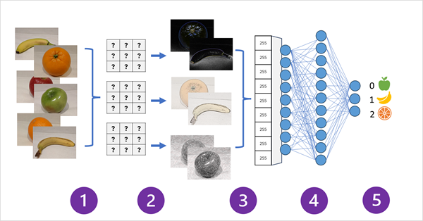
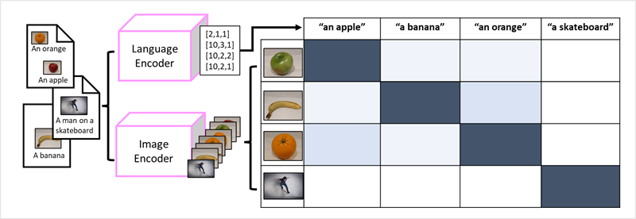
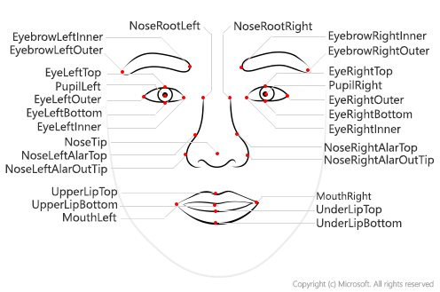
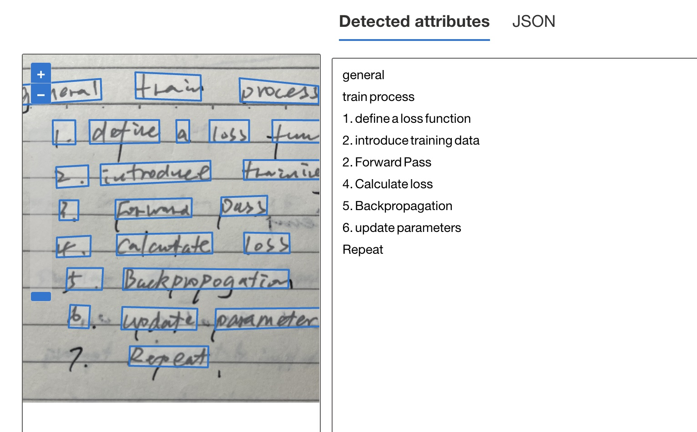

# fundamentals of computer vision

computer vision is one of the core areas of ai, and foucs on creating solutions enable ai application to "see" the world and make sense of it. 

## images and image processing

Images as pixel arrays (像素数组)
ignored

## machine learning for computer vision

the ability to use filter to apply effects to images is useful in image processing tasks, such as image edit software.
however, the goal of computer version is often to extract meaning, or at least actionable insights, from images.  which requires the creation of machine models that are trained to recognize features on large volumes of existing images.

### convolutional neural networks (CNNs)

**What**
CNNs uses filters to extract numeric feature maps from images, and then feed the feature values into a deep learning model to generate a label prediction.
**training process**
filter kernels are initially defined using randomly generated weight values. then, as the training process progresses, the models predications are evaluated against known labels values, and the filter weights are adjusted to improve accuracy. eventually, the trained model uses the filter weights that beast extract features.

how a cnn for an image classification model works



1. images with known labels (0: apple, 1: banana, 2: orange) are fed into the network to train the model.
2. one or more layers of filters is used to extract features from each image as it is fed through the network.
3. the feature maps are flattened into a single dimensional array of feature values
4. the feature values are fed into a fully connected neural network
5. the output layer of the neural network uses a softmax or similar function to produce a result. for example [0.2, 0.5, 0.3]

the output are compared to the actually class label. for example banana should have the value [0, 1, 0]. the difference between the predicted and actual class score to calculate the *loss* in the model, and the weights in the fully connected neural network and the filter kernels in the feature extraction layers are modified to reduce the loss.

the training process repeats over multiple epochs until an optimal set of weights has been learned.

### transformers and multi-modal models

object detection models combine CNN feature extraction layers with the identification of regions of interest in images to locate multiple classes of object in the same image.

#### transforms

transformers work by processing huge volumes of data, and encoding language token as vector-based embeddings. the embeddings are created such that are commonly used in the same context are closer together dimensionally than unrelated words. tokens that are semantically similar are encoded in similar positions, creating a semantic language model that makes it possible to build sophisticated NLP solutions for text analysis, translation, language generation, and other tasks.

#### multi-modal models

success of transformers has led AI researchers to consider whether the same approach would be effective for image data; the result is multi-modal models, in which the model is trained using a large volume of captioned images, with no fixed labels. an image encoder extract features from images based on pixel values and combine them with text embeddings created by a language encoder. the overall model encapsulates relationships between natural language token embeddings and image features.



the Microsoft *Florence* model is just such a model. trained with huge volumes of captioned images from internet, it includes both language encoder and an image encoder. can use Florence model as foundation model for adaptive models that perform

- image classification
- object detection
- captioning 
- tagging

multi-modal models are at the cutting edge of computer vision and AI in general.

## azure ai version

### az resources for az ai vision service

either of the following resource type

- az ai vision: for use az ai vision only. or track cost separately.
- az ai service: includes all az ai services. 

### analyzing images with the az si vision service
submit image to az ai version service to perform a wide range of analytical tasks
- OCR
- generating captions and descriptions of images
- detection of thousands of common objects in images
- tagging visual features in images

### training custom models

- image classification
- object detection

## exercise - analyze images in vision studio

[exercise link](https://microsoftlearning.github.io/mslearn-ai-fundamentals/Instructions/Labs/03-image-analysis.html)

- generate captions
- tagging
- tagging images
- object detection

# fundamentals of facial recognition

*what* to locate and analyze human faces in images or video content
*use cases*

- security, in building security apps, mobile device os for unlocking devices
- social media, automatically tag known friends in photographs
- intelligent monitoring, monitor driver's face to determine if the driver is looking at road, looking at a mobile device, or shows signs of tiredness.
- advertising, direct ad to an appropriate demographic audience
- missing persons
- identity validation - useful at ports of entry kiosks (亭) where a person holds a special entry permit.

## understand facial analysis

**Face detection** involves identifying regions of an image that contain a human face, typically by returning bounding box coordinates that from a rectangle around the face.

with **face analysis**, facial features can be used to train machine models to return other info.


### facial recognition

*what* a further app of facial analysis is to train a machine model to identify known individuals from their facial features; which uses multiple images of an individual to train the model. 

## get started with facial analysis on az

available ai service to detect and analyze faces

- az ai vision; face detection and some basic face analysis
- az ai video indexer; detect and identify faces in a video
- az ai face; pre-built algorithm that can detect, recognize, and analyze faces

### az ai face service

return rectangle coordinates for any human faces found in an image, as well as a series of related attributes.

- accessories
- blur (模糊), how blurred the face is, how likely the face is to be the main focus of the image
- exposure (曝光度)
- glasses
- head pose, the face's orientation in a 3D space
- mask
- noise, refers to visual noise in the image (high ISO -> noise)
- occlusion (遮挡), determines if there might be objects blocking the face in the image.
- quality for recognition, a rating of high, medium, or low that reflects if the image is sufficient quality to attempt face recognition on.

### responsible ai use

anyone can use face service to:

- detect the location of faces in an image
- determine if a person is wearing glasses
- determine if there is occlusion, blur, noise, or over/under exposure for any of the faces
- return the head pose coordinates for each face in an image

the limitation access policy requires customers to submit an intake form to access additional:

- face verification, compare faces for similarity
- face identification, identify named individuals in an image
- Liveness detection, detect and mitigate instances of recurring content and/or behaviors that indicate a violation of policies.

### az resources for face

- face, specific resource type
- az ai service, general ai resource

### tips

- image format: jpeg, png, gif, and bmp
- size, 6 mb or smaller
- face size range, 36x36 pixels up to 4096x4096
- other issues, face detection can be impaired by extreme face angles, extreme lighting, and occlusion

## exercise - defect faces in vision studio

[exercise url](https://microsoftlearning.github.io/mslearn-ai-fundamentals/Instructions/Labs/04-face.html)

# fundamentals of optical character recognition

what: machine can read the text in image using optical character recognition (OCR), the capability for ai to process word in images into machine-readable text. 

how: detect text in images -> convert it into a text-based data format -> stored/printed/other processing or analysis
why: improve speed and efficiency of work by removing the need for manual data entry
use cases: note taking, digitizing medical records, scanning checks for bank deposits, etc

## get started with az ai vision

computer system process written and printed text = intersects (computer vision and NLP)

- computer vsion: "read" the text
- nlp: make sense if readed text
OCR is the foundation of procesing text in image, using machine trained learning models to recognize individual shapes (letters, numerals, punctuation, or other elements of text)
early work on postal service to automatic sorting of mail based on postal codes

### az ai vision's OCR engine

AZ AI Vision read API (read OCR engine) to extract text from images, PDFS, and TIFF files. 
read OCR engine use latest recognition models and is optimized for images; consider the number of lines of text, images that include text, and handwriting
how: OCR engine takes in an image file and identifies bounding boxes, or coordinates, where items are located within an image. 
return result:

- pages, one for each page of text, including info about the page size and orientation
- lines, the lines of text on a page
- words, the words in a line of text, including the bounding box coordinates and text itself

## get started with vision studio on az

required az resource type

- az ai vision: use it if don't intent to use any other ai services, or want track utilization and costs for ai vision resource separately
- az zi service: general resource about az ai services. 
ways to use az ai vision read api
- vision studio
- rest api
- sdk

when open vision studio, default resource must be an az ai service resource, rather than az ai vision resource

```json
[
  {
    "lines": [
      {
        "text": "general",
        "boundingPolygon": [
          {
            "x": 474,
            "y": 190
          },
          {
            "x": 1005,
            "y": 149
          },
          {
            "x": 1010,
            "y": 275
          },
          {
            "x": 476,
            "y": 313
          }
        ],
        "words": [
          {
            "text": "general",
            "boundingPolygon": [
              {
                "x": 478,
                "y": 190
              },
              {
                "x": 1002,
                "y": 150
              },
              {
                "x": 1006,
                "y": 278
              },
              {
                "x": 480,
                "y": 313
              }
            ],
            "confidence": 0.941
          }
        ]
      },
      {
        "text": "train process",
        "boundingPolygon": [
          {
            "x": 1191,
            "y": 107
          },
          {
            "x": 2356,
            "y": 168
          },
          {
            "x": 2353,
            "y": 304
          },
          {
            "x": 1191,
            "y": 267
          }
        ],
        "words": [
          {
            "text": "train",
            "boundingPolygon": [
              {
                "x": 1215,
                "y": 109
              },
              {
                "x": 1618,
                "y": 128
              },
              {
                "x": 1620,
                "y": 285
              },
              {
                "x": 1218,
                "y": 271
              }
            ],
            "confidence": 0.851
          },
          {
            "text": "process",
            "boundingPolygon": [
              {
                "x": 1858,
                "y": 145
              },
              {
                "x": 2344,
                "y": 195
              },
              {
                "x": 2346,
                "y": 304
              },
              {
                "x": 1861,
                "y": 292
              }
            ],
            "confidence": 0.972
          }
        ]
      },
      {
        "text": "1. define a loss function",
        "boundingPolygon": [
          {
            "x": 706,
            "y": 403
          },
          {
            "x": 2691,
            "y": 402
          },
          {
            "x": 2691,
            "y": 550
          },
          {
            "x": 706,
            "y": 553
          }
        ],
        "words": [
          {
            "text": "1.",
            "boundingPolygon": [
              {
                "x": 706,
                "y": 405
              },
              {
                "x": 845,
                "y": 405
              },
              {
                "x": 847,
                "y": 553
              },
              {
                "x": 708,
                "y": 554
              }
            ],
            "confidence": 0.955
          },
          {
            "text": "define",
            "boundingPolygon": [
              {
                "x": 932,
                "y": 404
              },
              {
                "x": 1362,
                "y": 403
              },
              {
                "x": 1364,
                "y": 544
              },
              {
                "x": 935,
                "y": 551
              }
            ],
            "confidence": 0.771
          },
          {
            "text": "a",
            "boundingPolygon": [
              {
                "x": 1468,
                "y": 403
              },
              {
                "x": 1547,
                "y": 403
              },
              {
                "x": 1548,
                "y": 542
              },
              {
                "x": 1470,
                "y": 543
              }
            ],
            "confidence": 0.965
          },
          {
            "text": "loss",
            "boundingPolygon": [
              {
                "x": 1672,
                "y": 403
              },
              {
                "x": 1917,
                "y": 403
              },
              {
                "x": 1917,
                "y": 540
              },
              {
                "x": 1673,
                "y": 541
              }
            ],
            "confidence": 0.938
          },
          {
            "text": "function",
            "boundingPolygon": [
              {
                "x": 2060,
                "y": 404
              },
              {
                "x": 2674,
                "y": 408
              },
              {
                "x": 2674,
                "y": 547
              },
              {
                "x": 2061,
                "y": 541
              }
            ],
            "confidence": 0.566
          }
        ]
      },
      {
        "text": "2. introduce training data",
        "boundingPolygon": [
          {
            "x": 708,
            "y": 672
          },
          {
            "x": 2848,
            "y": 649
          },
          {
            "x": 2850,
            "y": 780
          },
          {
            "x": 710,
            "y": 822
          }
        ],
        "words": [
          {
            "text": "2.",
            "boundingPolygon": [
              {
                "x": 728,
                "y": 693
              },
              {
                "x": 925,
                "y": 682
              },
              {
                "x": 927,
                "y": 810
              },
              {
                "x": 731,
                "y": 823
              }
            ],
            "confidence": 0.897
          },
          {
            "text": "introduce",
            "boundingPolygon": [
              {
                "x": 1001,
                "y": 677
              },
              {
                "x": 1678,
                "y": 654
              },
              {
                "x": 1679,
                "y": 777
              },
              {
                "x": 1003,
                "y": 806
              }
            ],
            "confidence": 0.868
          },
          {
            "text": "training",
            "boundingPolygon": [
              {
                "x": 1882,
                "y": 650
              },
              {
                "x": 2400,
                "y": 651
              },
              {
                "x": 2400,
                "y": 769
              },
              {
                "x": 1884,
                "y": 772
              }
            ],
            "confidence": 0.586
          },
          {
            "text": "data",
            "boundingPolygon": [
              {
                "x": 2556,
                "y": 653
              },
              {
                "x": 2841,
                "y": 661
              },
              {
                "x": 2841,
                "y": 775
              },
              {
                "x": 2556,
                "y": 770
              }
            ],
            "confidence": 0.938
          }
        ]
      },
      {
        "text": "2. Forward Pass",
        "boundingPolygon": [
          {
            "x": 746,
            "y": 899
          },
          {
            "x": 2038,
            "y": 871
          },
          {
            "x": 2039,
            "y": 987
          },
          {
            "x": 746,
            "y": 1022
          }
        ],
        "words": [
          {
            "text": "2.",
            "boundingPolygon": [
              {
                "x": 749,
                "y": 899
              },
              {
                "x": 865,
                "y": 898
              },
              {
                "x": 863,
                "y": 1021
              },
              {
                "x": 747,
                "y": 1022
              }
            ],
            "confidence": 0.317
          },
          {
            "text": "Forward",
            "boundingPolygon": [
              {
                "x": 1094,
                "y": 896
              },
              {
                "x": 1563,
                "y": 886
              },
              {
                "x": 1561,
                "y": 1002
              },
              {
                "x": 1092,
                "y": 1015
              }
            ],
            "confidence": 0.769
          },
          {
            "text": "Pass",
            "boundingPolygon": [
              {
                "x": 1745,
                "y": 880
              },
              {
                "x": 2028,
                "y": 871
              },
              {
                "x": 2026,
                "y": 986
              },
              {
                "x": 1743,
                "y": 996
              }
            ],
            "confidence": 0.883
          }
        ]
      },
      {
        "text": "4. Calculate loss",
        "boundingPolygon": [
          {
            "x": 729,
            "y": 1112
          },
          {
            "x": 2164,
            "y": 1097
          },
          {
            "x": 2167,
            "y": 1223
          },
          {
            "x": 729,
            "y": 1249
          }
        ],
        "words": [
          {
            "text": "4.",
            "boundingPolygon": [
              {
                "x": 732,
                "y": 1128
              },
              {
                "x": 940,
                "y": 1117
              },
              {
                "x": 938,
                "y": 1243
              },
              {
                "x": 730,
                "y": 1250
              }
            ],
            "confidence": 0.834
          },
          {
            "text": "Calculate",
            "boundingPolygon": [
              {
                "x": 1102,
                "y": 1110
              },
              {
                "x": 1689,
                "y": 1098
              },
              {
                "x": 1690,
                "y": 1227
              },
              {
                "x": 1101,
                "y": 1238
              }
            ],
            "confidence": 0.597
          },
          {
            "text": "loss",
            "boundingPolygon": [
              {
                "x": 1885,
                "y": 1098
              },
              {
                "x": 2164,
                "y": 1103
              },
              {
                "x": 2167,
                "y": 1225
              },
              {
                "x": 1887,
                "y": 1225
              }
            ],
            "confidence": 0.964
          }
        ]
      },
      {
        "text": "5. Backpropagation",
        "boundingPolygon": [
          {
            "x": 768,
            "y": 1315
          },
          {
            "x": 2195,
            "y": 1315
          },
          {
            "x": 2196,
            "y": 1447
          },
          {
            "x": 768,
            "y": 1449
          }
        ],
        "words": [
          {
            "text": "5.",
            "boundingPolygon": [
              {
                "x": 796,
                "y": 1316
              },
              {
                "x": 1016,
                "y": 1316
              },
              {
                "x": 1010,
                "y": 1450
              },
              {
                "x": 789,
                "y": 1450
              }
            ],
            "confidence": 0.856
          },
          {
            "text": "Backpropagation",
            "boundingPolygon": [
              {
                "x": 1145,
                "y": 1317
              },
              {
                "x": 2161,
                "y": 1327
              },
              {
                "x": 2158,
                "y": 1439
              },
              {
                "x": 1139,
                "y": 1450
              }
            ],
            "confidence": 0.07
          }
        ]
      },
      {
        "text": "6. update parameters",
        "boundingPolygon": [
          {
            "x": 783,
            "y": 1542
          },
          {
            "x": 2450,
            "y": 1545
          },
          {
            "x": 2449,
            "y": 1697
          },
          {
            "x": 782,
            "y": 1695
          }
        ],
        "words": [
          {
            "text": "6.",
            "boundingPolygon": [
              {
                "x": 814,
                "y": 1543
              },
              {
                "x": 937,
                "y": 1549
              },
              {
                "x": 928,
                "y": 1688
              },
              {
                "x": 804,
                "y": 1684
              }
            ],
            "confidence": 0.03
          },
          {
            "text": "update",
            "boundingPolygon": [
              {
                "x": 1136,
                "y": 1556
              },
              {
                "x": 1598,
                "y": 1567
              },
              {
                "x": 1593,
                "y": 1697
              },
              {
                "x": 1128,
                "y": 1694
              }
            ],
            "confidence": 0.656
          },
          {
            "text": "parameters",
            "boundingPolygon": [
              {
                "x": 1712,
                "y": 1568
              },
              {
                "x": 2437,
                "y": 1561
              },
              {
                "x": 2437,
                "y": 1674
              },
              {
                "x": 1708,
                "y": 1697
              }
            ],
            "confidence": 0.843
          }
        ]
      },
      {
        "text": "Repeat",
        "boundingPolygon": [
          {
            "x": 1158,
            "y": 1797
          },
          {
            "x": 1678,
            "y": 1798
          },
          {
            "x": 1677,
            "y": 1929
          },
          {
            "x": 1157,
            "y": 1925
          }
        ],
        "words": [
          {
            "text": "Repeat",
            "boundingPolygon": [
              {
                "x": 1182,
                "y": 1798
              },
              {
                "x": 1666,
                "y": 1799
              },
              {
                "x": 1663,
                "y": 1929
              },
              {
                "x": 1178,
                "y": 1919
              }
            ],
            "confidence": 0.758
          }
        ]
      }
    ]
  }
]
```

## exercise - read text in vision studio

1.create an az ai service resource

- subscription
- resource group
- region
- name (of instance)
- price tier: standard s0

2.connect az ai service resource to vision studio

- https:portal.vision.cognitive.azure.com
- sign in and same directory
- view all resources under get start with vision
- select a resource to work

3.extract text from images in the vision studio

- open vision studio at https:portal.vision.cognitive.azure.com
- select optical character recognition, and then extract text from images
- under try it out, acknowledge the resource usage policy by reading and checking the box
- upload one sample img
- review what returned (see previous sample);

4.delete resource group to clean up