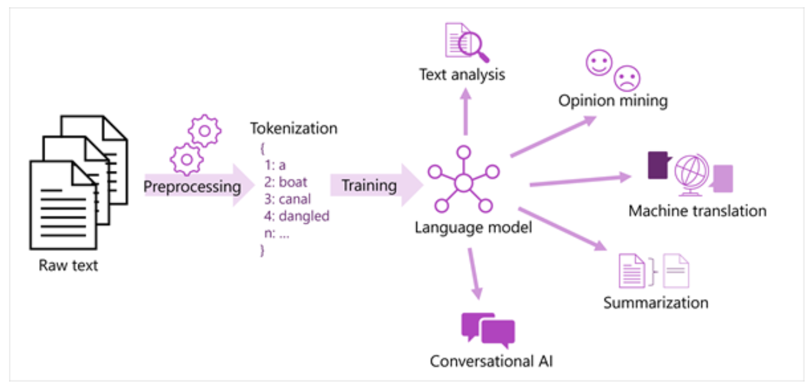
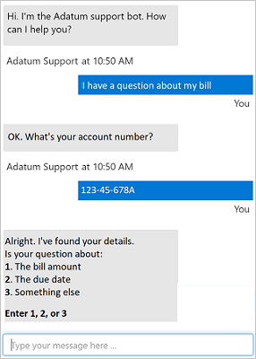
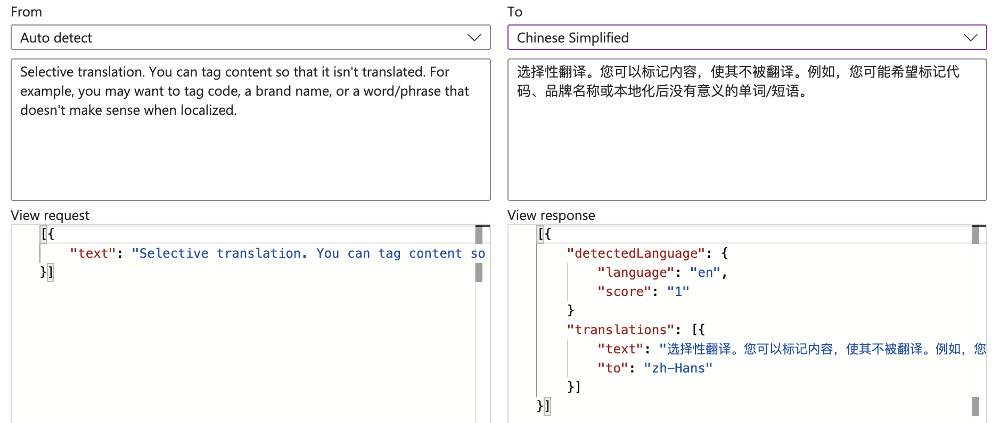

https://learn.microsoft.com/en-us/credentials/certifications/azure-ai-fundamentals/?practice-assessment-type=certification

# fundamentals of text analysis with the language service

NLP, an area within AI that deals with understanding written or spoken language, and responding in kind. *text analysis* describes NLP process that extract information from unstructured text.

use cases:

- social media feed analyzer detects sentiment for a product marketing campaign
- a doc search app that summarize doc in a catalog
- an app that extracts brands and company names from text

az al language is a cloud-based service for understanding and analyzing text. sentiment analysis, key phrase identification, text summarization, and conversational language understanding

## understand text analytics

earliest tech usedd to analyze text with computers involve statistical analysis for a body of text (a corpus) to infer some kind of semantic meaning.

### tokenization

first step in analyzing a corpus (语料库) is to break it down into tokens. token can be generated for partial words, or combinations of words and punctuation.

sample:
we choose to go to moon
[854, 5655, 316, 810, 316, 28479]

**note**
consider the following concepts apply to tokenization

- **text normalization**; normalize text by removing punctuation and changing all words to lower case.
- **stop word removal**. should be excluded from the analysis. for example, "the", "a", "it". may be better to identify the important words
- **n-grams** (多项短语) are multi-term phreses such as "i have" or "he walked"
- **stemming** is a tech in which algorithm are applied to consolidate words before counting them. "power", "powered", "powerful" are interpreted as bing the same token (tiktoken not in the case)

### Frequency analysis

count of occurrences of each token. the most commonly used words can often provide a clue as to the main subject of a text corpus.

*term frequency - inverse document frequency (TF_IDF)* is a common tech in which a score is calculate based on how often a word or term appears in one doc compared to its more general frequency across the entire collection of documents

*before stop word removal*
Document 1: how to reset my laptop password
  how: 0.4711101009983051
  laptop: 0.35829137488557944
  my: 0.2782452148327134
  password: 0.35829137488557944
  reset: 0.4711101009983051
  to: 0.4711101009983051

Document 2: i forgot my mobile password
  forgot: 0.5844829010200651
  mobile: 0.5844829010200651
  my: 0.34520501686496574
  password: 0.444514311537431

Document 3: my laptop can not start as normal
  as: 0.4107468350088512
  can: 0.4107468350088512
  laptop: 0.31238355521006117
  my: 0.24259369753845733
  normal: 0.4107468350088512
  not: 0.4107468350088512
  start: 0.4107468350088512

*after stop word removal*
Document 1: how to reset my laptop password
  laptop: 0.5178561161676974
  password: 0.5178561161676974
  reset: 0.680918560398684

Document 2: i forgot my mobile password
  forgot: 0.6227660078332259
  mobile: 0.6227660078332259
  password: 0.4736296010332684

Document 3: my laptop can not start as normal
  laptop: 0.4736296010332684
  normal: 0.6227660078332259
  start: 0.6227660078332259

### machine learning for text classification

another useful text analysis tech is to use a classification algorithm, such as logistic regression, to train a ml model that classifies text based on a known set of categorizations.

### semantic language models

the location of the tokens in the embeddings space include some info about how closely the tokens are related to one another. 

- text analysis, extract key terms or identifying named entities in text
- sentiment analysis and opinion mining to category text as positive or negative
- machine translation, translate from one language to another
- summarization, the main points of a large body of text are summarized
- conversational ai solution such as bots or digital assistants in which language model can interpret natural language input and return an appropriate response

## get started with text analysis

az ai language text analysis features:

- ner identify people, places, events, and more
- entity linking identifies known entities together with a link to wikipedia
- personal identifying information (PII) detection
- language detection
- sentiment analysis and opinion mining 
- summarization 
- key phrase extraction 

### entity recognition and liking

entity|type|subtype|wikipedia url

### language detection

identify the language in which text is written.

doc | language name | iso 6391 code | score

the language detection service focus on the **predominant** language in the text.

text might be ambiguous in nature, or has mixed language content. score is **NAN**

### sentiment analysis and opinion mining

sentiment:positive/neutral/negative, position score:0.90, neutral score:0.1, negative score:0.0

az ai language uses a prebuild ml classification model to evaluate the text. positive, neural, and negative

### key phrase extraction

identifies the main points from text, use key phrase extraction capabilities of the language service to summarize the main points

### create a resource

- a language resource
- an az zi services resource

## exercise - analyze text with language studio

[url](https://microsoftlearning.github.io/mslearn-ai-fundamentals/Instructions/Labs/06-text-analysis.html)

## knowledge check

# fundamentals of qa with language service

## understanding qa
question answering supports natural language AI workloads that require an automated conversational element.
build bot app that respond to customer queries.
capabilities: respond immediately, answer concerns accurately, and interact with users in natural multi-turned way.

*when list the possible question, then give choice from 1~3*

## get started with custom qa

az ai language service include a custom question and answering feature based on qa pairs that can be queried by natural language input.

### create a custom qa knowledge base

use az ai language studio to create, train, publish and manage qa project.

### define questions and answers

questions and answers can be

- generated from an existing FAQ doc or web page
- Entered and edited mannually
*alternative phrasing*

### test the project

when save question answer paris, this (save) process analyze literal qas and applies a built-in natural processing model to match appropriate answers to questions, even when they are not phrased exactly as specified in qas definitions. later test it by submitting questions ans reviewing the answers that are returned.

## exercise - use question answering with language studio
[exercise url](https://microsoftlearning.github.io/mslearn-ai-fundamentals/Instructions/Labs/07-question-answering.html)
[fqa](http://cs.mfa.gov.cn/zggmcg/cgqz/cjwd_660483/)

# fundamentals of conversational language understanding

use case: customer support app, reservation systems, and home automation, and others
az ai language services supports conversational language understanding (CLU), use CLU to build language models that interpret the meaning of phrases in a conversational settings.

## describe conversational language understanding

### utterances

an utterance is an example of something of a user might say, and which your app must interpret.
*"switch the fan on"*
*"turn on the light*

### entities
an entity is an item to which an utterance refers. **fan**, **light** in above sample

### intents
an intent represents the purpose, or goal, expressed in a user's utterance.

a CLU app defines a model consisting of intents and entities. utterances are used to train the model to identify the most likely intent and the entities to which it should be applied based on a given input. 

| intent | related utterances | entities
|---|---|---
|Greeting|Hello|
||Hi| 
|TurnOn | Switch the light on | fan (device)
||Turn on the light | light (device)

the above table, the intent should be concise way of grouping the utterance tasks. for the **None** intent, it is considered a fallback, typically used to provide a generic response when query not match any other intent.

after defining the table in CLU app, you can train a language model to predict intents and entities from user input.

## get started with conversational language understanding in az

CLU enable to author a language model and use it for predictions. authoring a model involves defining entities, intents, and utterances. generating predictions involves publishing a model so that client app can take user input and return response.

### az resource

- az ai language; nlu specific
- az ai servie; general az ai service

### authoring

create authoring resource, then use it to train CLU model.
to train a model, start by defining the entities and intents that app will predict as well as utterances for each intent that can be used to train the predictive model.
CLU provides a comprehensive collection of prebuilt *domains* for common scenarios. also support your own entities and intents

### training the model

training is the process of using sample utterances to teach model to match natural language expressions that user might say to probable intents and entities.
test the model by submitting text and reviewing the predicted intents.
training and testing is an iterative process.

### predicting

when satisfied with result from training and testing, publish CLU app to a prediction resource for consumption.
client app -> (model)-> by connecting to the endpoint for the prediction resource + authentication key -> (return) -> predictions

## exercise - user conversational language understanding with language studio

[exercise url](https://microsoftlearning.github.io/mslearn-ai-fundamentals/Instructions/Labs/08-conversational-language-understanding.html)

# fundamentals of az ai speech

use case

- manage home and auto system with voice instruction
- get answers from computers for spoken questions
- generate captions from audio
- much more

core capability

- speech recognition, to detect and interpret spoken input
- speech synthesis, to generate spoken output

az ai speech

- speech to text
- text to speech

## understand speech recognition and synthesis

### speech recognition

speech recognition takes spoken word and converts it into data the can be processed - often by transcribing it into text.
source: a recorded voice in an audio file; live audio from a microphone.

how: speech patterns are analyzed in the audio to determine recognizable patterns that are mapped to words. multiple models are used

- an acoustic(声学) model: converts the audio signal into phonemes (音素)
- a language model: maps phonemes to words, using statistical algorithm that predict the most probable sequence of words based on the phonemes

*phonemes are the smallest sounds in a language that can change the meaning of a word. for example, bat/pat differ by just one sound. changing that sound changes the word. each language has it own set of phonemes, and they help us distinguish between different words and meanings*

the recognized words are typically converted to text, and then used for:

- providing closed captions for recorded or live videos
- creating a transcript of a phone call or meeting
- automated note dictation
- determining intended user input for further processing

### speech synthesis

speech synthesis is concerned with vocalizing data, usually by converting text to speech.

- the text to be spoken
- the voice to be used to vocalize the speech

how
the system tokenize the text to break it down into individual words, and assigns phonetic sounds to each word. then breaks the phonetic transcription into prosodic units (phrases, clauses, or sentences) to create phonemes that be convert to audit format. these phonemes are then synthesized as audio and can be assigned a particular voice, speaking rate, pitch, and volume.
*process: text->word->phonetic sound->prosodic unit->phoneme->audit output

*phonetic sound: 语音; prosodic units: 韵律单位;*

use case:

- generating spoken response to user input
- creating voice menus for telephone system
- reading email or text messages aloud in hands-free scenarios
- broadcasting announcements in public location

## get started with speech on az

### az resources for ai speech
- speech resource: specific
- az ai services: general

### the speech to text api
source can be a real-time audio stream from a microphone or an audio file.
model info: based on universal language model tranined by microsoft, data is ownened by microsoft, and deployed on azure. the model is optmized for two case: conversational and dictation (听写); 
can also create and train own custom models.

- real-time transcription
what: transcribe text in audio streams. 
when (use case): presentation, demos, or other scenarios where a person is speaking
how: listening for incoming audio from a microphone/file -> streams audito to azure ai speech service -> transcribed text

- batch transcription
when: audio recordings
how: point to audiot files with a shared access signature (SAS) URI -> async receive transcription result

### the text to speech api
what: convert text input to audible speech; then played through a speaker or written to an audio file.

- speech synthesis voices
what: specify the voice to vocalize the text.
when: personalize speech synthesis and give it a specific character

the service includes multiple pre-defined voices with support for multiple languages and regional pronunciation, including neural voices, resulting in a more natural sounding voice. also support customization.

### supported languages
support a variety of languages

### exercise - explore speech studio
(exercise url)[https://microsoftlearning.github.io/mslearn-ai-fundamentals/Instructions/Labs/09-speech.html]

# fundamentals of language translation
use case: orgs and individuals collaborate with people in other cultures and geographic locations, they continue to need ways to remove language barriers.

through to hire multilingual people to translate between language; two cons: scarcity of such skills, possible language combination can make this approach difficult to scale.

here comes automated translation, sometime known as machine translation

## understand translation concepts
challenges of translation between language is that words don't have a one to one replacement between languages.

### literal and semantic translation
early attempts at machine translation applied literal translation (直译).
what? each word is translated to the corresponding word in the target language.
issues: may not be an equivalent (equal) word in the target language; change the meaning of the phrase or not get the context correct.

AI understand not only words, but also semantic context. as a result, a more accurate translation: grammar rules, formal vs informal, and colloquialisms all need to be considered

### text and speech translation
text translation: translate docs from one language to another
speech translation: translate between spoken languages; speech to speech, or speech to text. 

## understand translation in az
two service available: az ai translator, az ai speech 

### az ai translator
it uses a neural machine translation (NMT) model for translation, analysis semantic context of the text, and renders a more accurate and complete translation result. 
more than 130 languages are supported. 
source/target language code is used by refers ISO-639-1 language code (en) / 3166-1 cultures code (en-US)
### az zi speech
translate spoken audio from a stream source, return the translation as text or audio stream. 
use case: real-time closed captioning for speech, or simultaneous two-ways translation of a spoken conversation.
more than 90 languages are supported
source language must be 3166-1 cultures code. help source is understood properly, allowing for local pronunciation and linguistic idioms. 
target language must iso-639-1 language code

## get started with translation in az
### az resources 
- dedicated translator and speech resource types
- az ai service 
### using az ai translator
capabilities 
- text translation, used for quick and accurate text translation in real time
- doc translation, use to translate multiple docs while preserving original doc structure
- custom translation, for enterprise, app developers, and language service providers to build custom neural machine translation (NMT) system

az ai translator's api offers some optional configuration to fine-tune result
- profanity (粗言秽语) filtering; two options: mark translated text as profane, or by omitting in the result. 
- selective translation; tag content is not translated. for example, brand name, work/phrase doesn't make sense when localized

### speech translation with az ai speech
- speech to text
- text to speech
- speech translation: translate speech in one language to text/speech in another 

## exercises - explore az ai translator
[exercise url](https://microsoftlearning.github.io/mslearn-ai-fundamentals/Instructions/Labs/15-translation.html)

## knowledge check
1. What is the main function of the Azure AI Translator service? 

A. To translate spoken audio from a streaming source into text or an audio stream.

B. To support text-to-text translation between more than 130 languages using a Neural Machine Translation model.
*Correct. Azure AI Translator uses a Neural Machine Translation model to analyze the semantic context of the text and render a more accurate and complete translation.*

C. To support multiple AI capabilities including text analysis, translation, and speech.
*Incorrect. Azure AI Services supports multiple AI capabilities, Azure AI Translator supports specific capabilities.*