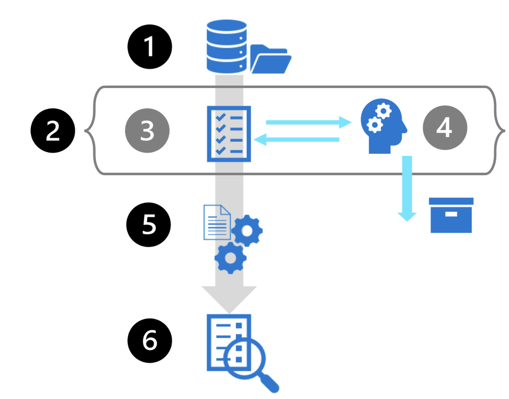

# fundamentals of az ai di
what: 
- support processing text and making sense of info in text.
- ocr, read doc, extract, understanding, and saving the data in text

use case:
scan receipt, digitize text with ocr, pair the filed items. 

## explore capabilities of di
az ai di relies on machine learning models trained to recognize data in text. 
doc analysis: extract text, layout, and key-value paris, locations of text on a page identified by bounding box coordinates.

a challenge for automating the process of analyzing docs is that forms and docs come in all different formats. 

separated machine learning models need to be trained to provide high quality results for different forms and docs. 

## understand az ai di capabilities
az ai di consists of features grouped by model type:
- doc analysis; general doc analysis that return structured data representations, including regions of interest and their inter-relationship
- prebuilt models; have been build to process common doc types such as invoices, business card, id doc, and more.  
- custom models; tranined to identify specific fields that are not included in the existing pre-trained models. 

### prebuilt models 
main types of docs prebuilt models can process financial service, legal, us tax, us mortgage, pid. example:
- customer and vendor details from invoices
- sales and transaction details from receipts
- identification and verification details from identity docs
- health insurance details
- business contact details
- agreement and party details from contracts
- taxable compensation, mortgage interest, student loan details and more

an details sample on prebuilt receipt model
- matching filed names to values
- identifying tables of data
- identifying specific fields, such as dates, telephone numbers, and more

receipt model has been training to recognize data on several types, such as thermal, hotel, gas, credit card, parking. fields include
- name, address, and telephone number of the merchant
- date and time of the purchase
- name, quantity, and price of each item purchased
- total, subtotals, and tax values 

*each field and data pair has a confidence level*

### using az zi di
create either di resource or az ai service resource


## exercise - extract form data in di studio

result
```python
{
	"status": "succeeded",
	"createdDateTime": "2024-11-03T06:24:56Z",
	"lastUpdatedDateTime": "2024-11-03T06:24:59Z",
	"analyzeResult": {
		"apiVersion": "2023-07-31",
		"modelId": "prebuilt-read",
		"stringIndexType": "utf16CodeUnit",
		"content": "合併資產負債表\n(千元,每股數額除外)\n負債、可贖回少數股東權益及股東權益\n流動負債:\n應付賬款\n1,507,141\n4,732,941\n應付工資及福利\n14\n2,813,096\n應付税款\n短期借款\n合同負債\n計提債項及其他應付款 17 11,122,022 短期經營租賃負債 10 259,053\n流動負債總額\n非流動負債:\n遞延所得稅負債\n13(c)\n長期經營租賃負債\n10\n長期借款\n其他長期應付款\n非流動負債總額\n負債總額\n附註\n15 23,875,704\n16 12,518,890\n18\n承諾及或有事項\n24\n可贖回少數股東權益\n2022年\n12月31日\n人民幣\n56,828,847\n2,126,120\n672,640\n3,654,964\n604,934\n7,058,658\n63,887,505\n19\n136,440\n2023年\n12月31日\n人民幣\n881,016\n4,857,206\n2,571,534\n19,240,163\n13,362,166\n12,670,906 259,493\n53,842,484\n2,299,303\n555,829\n427,997\n715,284\n3,998,413\n57,840,897\n115,759\n2023年\n12月31日\n美元\n附註2(q)\n124,089\n684,123\n362,193\n2,709,920\n1,882,022\n1,784,660\n36,549\n7,583,556\n323,850\n78,287\n60,282\n100,745\n563,164\n8,146,720\n16,304",
		"pages": [...],
		"styles": []
	}
}
```


# fundamentals of km and az ai search
how to improve the speed of info retrieval and gain novel insights

knowledge mining solutions provide automated info extraction from large volumes often unstructured data. - AZ AI Search

## what is az ai search
### what
az ai search is PaaS, it provides infra and tools to create search solution that extract data from various structured, semi-structured, and non-structured docs. 

docs -> az si search-> data &index

data
- text inferred
- text extracted from images
- new entities 
- key phrases

### features
az ai search engine built on apache lucene. az ai search provides 99.9% SLA. 

features:
- data from any source;
- multiple options for search and analysis; vector search, full text, and hybrid search. 
- AI enrichment; has az ai capabilities built in for image and text analysis from raw content
- linguistic analysis; analysis for 56 language to intelligently handle phonetic matching or language-specific linguistics. 
- configurable user experience; has options for query syntax including vector, text, hybrid, fuzzy, autocomplete, geo, and more 
- az scale, security, and integration. 

## identity elements of a search solution 



in an az ai search solution, you create a search index by moving data through the following indexing pipeline:
1. start with a **data source**; the storage location of your original data artifacts. 
2. **indexer**; automates the movement data from the data source through document cracking and enrichment to indexing. an indexer automates a portion of data ingestion (数据采集) and exports the original file type to json. 
3. **doc cracking**; the indexer opens files and extract content
4. **enrichment**; indexer moves data through ai enrichment, which implement az ai on original data to extract more info. ai enrichment is achieved by adding and combing skills in a skillset. 
a skillset defines the operations that extact and enrich data to make it searchable; such as text translation, OCR, or custom skills. example of ai enrichment include adding captions to a photo and evaluating text sentiment. ai enriched content can be sent to a knowledge store, which persists output from an ai enrichment pipeline in tables and blobs in az storage for independent analysis or download processing. 
5. **push to index**; serialized json data populates the search index.
6. the result is a populated **search index**, which can be explored through queries. 

## create an index in az portal
first step is to provision and az ai resource

using az portal import data, which will defines the search index and runs the indexer. 
- data source; persist connection info to source data, including credentials. a data source object is used exclusively with indexers. 
- index; physical data structure used for full text and other queries
- indexer; a configuration object specifying a data source, target index, an optional ai skillset, optional schedule, and optional configuration settings for error handing and base-64 encoding.
- skillset; a comlete set of instruction for manipulating, transforming, and shaping content, including analyzing and extracting info from image files.
- knowledge store; stores output from ai enrichment pipeline in tables and blobs in az storage for independent or downstream processing. 

*ref about index and indexer from open-ai*
- index: the storage structure for searchable content. 
- indexer: the toll or service that populates and updates the index with data from external sources. 

## query data in az ai search index
az ai search query can be submitted as an http or rest api request, with the response coming back as json. queries can specify what fields are searched and returned, how search results are shaped, and how the results should be filtered or sorted. if not specify filed to search will execute against all the searchable fields within the index.

two types of syntax: simple and full lucene.
- simple syntax covers all the common query
- full lecene is useful for advanced scenarios

### simple query request
query = search term (a list, or words) + query operation (simple or full).

sample:
```
coffee (-"busy" + "wifi")
```
this query is trying to find content about coffee, excluding busy and including wifi.  three steps:
1. search for all docs related to coffee
2. form the set of docs, exclude any that mention "busy"
3. further narrow down the result to include only those that mention "wifi"; *(match with exactly, wi-fi would not be a match)*

## exercise - explore an az ai search index (UI)
create resource (ai search or ai service) -> create storage and load data -> index the data (skillet optional) -> query the index -> review knowledge store
## knowledge check 