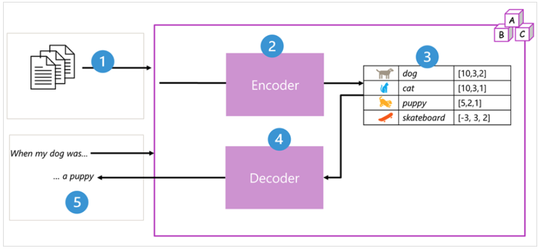
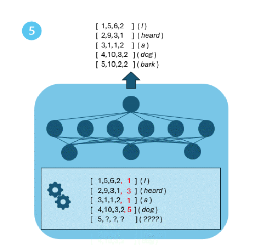
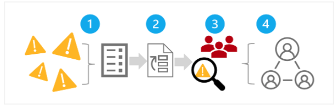

# fundamentals of gen ai
application of mathematical techniques and refined over many years of research into statistics, data science, and machine learning. 
acknowledge core concepts and principles 

## what is gen ai
**AI** imitates *human behavior* by using *machine learning* to interact with the environment and execute tasks without explicit direction on wha to output.
**Gen AI** describe a category of capabilities within AI that *create original content*

- natural language generation 
- image generation
- code generation

## what are language models
*GEN AI* apps are powered by *language models*, a specialized type of machine learning model use to NLP tasks
- determining sentiment or otherwise classifying natural language text
- summarizing text
- comparing multiple text sources for semantic similarity 
- generating new natural language

### transformer models
machine learning models for nlp have evolved over many years. today's cutting-edge language models are based on transformer architecture, which build on and extends some technique that have been proven successful in modeling vocabularies to support NLP tasks. 

transformer model are *trained with large volumes of text*, enabling them to *represent the semantic relationships* between words, and use those relationships to *determine probable sequences* of text that make sense. 

two core components: 
- an **encoder** creates semantic representations of the training vocabulary; (chatgpt: read and understand input)
- a **decoder** generates new language sequences; (chatgpt: generate an output on that understanding)


1. the model is trained with large volume of natural language text, often source from internet or other public source of text
2. the sequences of text are broken down into *tokens (a small unit of text, for example, individual words)* and the encoder processes these tokens sequences using *attention* to determine *relationships between tokens*. 
3. the output from the encoder is a collection of *vectors (a mathematical representation of tokens)* in which each element of the vector represents a semantic attribute of the tokens. these vectors are referred to as *embeddings*
4. the decoder works on a new sequence of text tokens and uses the embeddings generated by the encoder to generate an appropriate natural language output.
5. for example, give an input sequence like 'when my dog was', the model can use the attention technique to analyze the input tokens and the semantic attributes encoded in the embeddings to predict an appropriate completion of the sentence, such as 'a puppy'  

in practice, the specific implementation of the architecture vary; bert use only encoder, GPT use only decoder. 

### tokenization
fist step is to decompose the training text into tokens

```
token id:3041; token:Re
token id:5372; token:place
token id:4600; token: `
token id:22866; token:context
token id:63; token:`
token id:416; token: by
token id:597; token: any
token id:2420; token: text
token id:345; token: you
token id:1549; token:'d
token id:588; token: like
token id:0; token:!
```
### embedding
token do not tell anything about the meaning or relationship of the words.  therefore, comes the contextual vectors (embeddings) for the words.

what? vectors are multi-value numeric representations of info. the vector describes the direction and distance of the path from origin to end.

### Attention
*encoder* and *decoder* in a transformer model include multiple layers that from the neural network for the model. 
attention layer is used in both (encoder and decoder)

what? a technique used to examine *a sequence of text tokens* and try to quantify the *strength of the relationship* between them. in particular, self-attention involves considering how *other tokens* around one particular token *influence that token's meaning*. 

in an encoder, each token is carefully examined in context, and an appropriate encoding is determined for its vector embedding. the vector values are based on the relationship between the token and other tokens with which it frequently appears. 

in a decoder, attention layers are used to *predict the next token* in a sequence. for each token generated, the model has an attention layer that takes into account the sequence of tokens up to that point (该点之前的sequence of tokens). the model consider which of the tokens are the most influential (最具影响力) when considering what the next token should be. 

for example: I **heard** a **dog** **[bark]**

remember that attention layer is working with numeric vector representations of the tokens, not the actual text.  in a decoder, the process starts with a sequence of token embeddings representation the text be to completed. the first thing happens is that another **positional encoding** layer adds a value to each embedding to indicate its position in the sequence:

- [**1**, 5, 6, 2] (I)
- [**2**, 9, 3, 1] (heard)
- [**3**, 1, 1, 2] (a)
- [**4**, 10, 3, 2] (dog)

during training, the goal is to predict the vector for the final token in the sequence based on the preceding tokens. the attention layer assigns a numeric *weight* to each token in the sequence so far. it uses that value to perform a calculation on the weighted vectors that produces an *attention score* the can be used to calculate a possible vector for the next token. in practice, a technique called multi-head attention uses different element of the embeddings to calculate attention scores. a neural network is then used to evaluate all possible tokens to determine the most probable token with which to continue the sequence. the process continue iteratively for each token in the sequence, with output sequence so far being used regressively as the input for the next iteration. 



[1,3,1,5] is weight
[5, 10, 2, 2] (bark) is the most probable token
middler of the image is a fully connected neural network 
..
go the next iteration 

during training, the actual sequence is known. as in any neural network, the predicted value for the token is compared to the actual value of the next vector in the sequence. and then **loss** is calculated. the wights are then incrementally adjusted to reduce the loss and improve the model. 

**prompt** a text input
**completion** generated a syntactically correct output 

* [translate text with transformer model @ tensorflow.com](https://www.tensorflow.org/text/tutorials/transformer)

## using language models
org and developer can train their own models from scratch, but in most cases use and existing foundation model, and optionally fine-tune it with custom training data. 

on az, find foundation models in az openai service and in the model catalog.

also support ooen-source models from
- openai
- huggingface
- mistral
- meta and others

common used az openai models:
- gpt-3.5-turbo, gpt-4, and gpt-4o; for conversion and message-out language models
- gpt-4 turbo with vision; analyze images and provide textual response 
- dall-e; generate image. 

### LLM and SLM 
- smaller, subject-focus datasets
- fewer parameters
- specific conversation topics
- smaller size provide more options for deployment
- fine-tuning be less time-consuming and less expensive 

## what are copilots (vs agent ?)
LLM led to emergence of new ways to interact with app and system through digital copilots. 

what? copilots are generative ai assistants that are integrated into app often as chart interface. they provide contextualized support for common task in those apps. 

why? 
- biz users can use copilots to boost their productivity and creativity with ai-generated content and automation of tasks. 
- developer extend copilots by creating plug-in that integrate these copilots into biz process and data, or even create custom copilots to build gen ai capabilities into app and services. 

### levels of copilot adoption
- use *off-the-shelf* copilots, 
- *extend* copilots to support biz process or tasks, using your own data to control copilot
- *build custom* copilots to integrative gen ai into biz apps

## ms copilot

### web browsing with AI
what? to answer question, create content, and search web. also built in Edge browser.

### ai assistance for info worker
**copilot for m365**; generate new doc based on nlp prompt, then refine, summarize, and improve the doc with a few prompts; 
**power bi**; generate a whole presentation based the contents of a doc or email; then add graphic, reformat slides.
**outlook**, summarize email, check schedule, find related email/docs to prepare for meeting

### use ai to support biz process
**dynamics365**; analyze support tickets, research similar issue, find resolutions, etc
**dynamics365 sales**; find relevant customer and industry info by integrating CRM. quickly review and qualify a lead, generate proposal, setup a customer engagement to close the deal. 
**dynamics365 supply chain**; handles changes to purchase orders.

### ai assisted data analytics
**fabric**; generate code they need to analyze, manipulate, and visual in Spark notebooks
**power bi**; analyze data and then suggest and create appropriate data visualizations form it

### manage it infra and security 
**m365 defender**; provide assistance for security professionals as the asses, mitigate, and respond to security threats.
**azure**; integrated into az portal to assistant infra admin

### ai powered software development
**github** analyzing and explaining code, adding code doc, generating new code based on nlp, and more.

## consideration for copilot prompts
consideration
- start with a specific goal
- provide a source to ground the response in a specific scope of info
- add context to maximize response appropriateness and relevance
- set clear expectation for response
- iterate based on previous prompts and response to refine the result 

copilot send prompt to llm
- system message
- conversation history for the current session, include past prompts and responses.
- current prompt

## extending and developing copilots

### use copilot studio 
to develop custom copilots for developer and biz users. a fully managed saas solution. 

### az ai studio
a paas development portal for developer on llm (also fine-tune model with data)

## exercise - explore ms copilot


# introduction to ai studio

## what is az ai studio
ai studio bring az ai services together in a single unified experience for ai development on az cloud platform
- model catalog and prompt flow development on az machine learning
- gen ai model deployment, testing and custom data integration on az openai
- integration with ai service for speech, vision, language and doc intelligence, and content safety

other features:
- creating az ai hubs provide collaborative development workspace for data scientist, developers, and others to build AI solutions
- create project in which assets and code for a specific solution are managed
- scalable, on-demand compute
- integration with data sources and other cloud service
- web-based code dev environments 
- SKD and CLI libraries  

### what can do ?
- deploying models
- deployment and testing gen ai models 
- integrating data from custom data sources to support RAG
- using prompt flow to define workflows that integrate model, prompts and custom processing
- integrate content safety into gen ai solution 
- extend a gen ai solution with multiple ai capabilities

## how does az ai studio work
an az ai hub can host one or more projects, each encapsulates the tools and assets used to create a specific ai solution

### what can do with az ai hub
- create members and assign them to specific roles
- create and manage compute instance on which to run experiments, prompt flows, and custom code
- create and manage connection to resource
- define policies to manage behavior 

### what can do with a project
- deploy llm 
- testing chat model
- add custom data to augment prompts
- use prompt flow 
- evaluate model response to prompts
- manage indexes and datasets for custom data
- define content filters to mitigate potentially harmful responses
- use vs code in browser to create custom code
- deploy solution as web apps and containerized services

### associated az resources
- storage account
- key vault
- container registry 
- application insight
- az openai service 

## when to use az ai studio
- create and manage ai projects
- develop gen ai application
- explore available ai models 
- leverage RAG
- monitor and evaluate ai models
- integrate with az service
- build responsibly

## exercise - explore az ai studio


# responsible gen ai
gen ai solution must be implemented responsibly to minimize the risk of harmful content generation 
*[ms responsible ai standard](https://www.microsoft.com/en-us/ai/responsible-ai)*

## plan a responsible gen ai solution
four stages to dev and implement a pan for responsible gen ai
1. identify potential harms relevant to solution 
2. measure the presence of these harms in the outputs 
3. mitigate the harms at multiple layers in solution to minimize their presence impact, and ensure transparent communication about potential risks to users
4. operate the solution responsible by defining and following a deployment and operation readiness plan (部署和运营准备计划)

*closely to NIST AI Risk Management Framework*

## identify potential harms (#1)

### 1. identity potential harms
harms from 
- output from ai service, or models
- any fine-tuning or grounding data to customize outputs

harm types:
- content (output) is offensive, pejorative(贬损), or discriminatory(歧视)
- contains factual inaccuracies (事实错误) 
- encourage or support illegal or unethical behavior 

refs
[transparency note](https://learn.microsoft.com/en-us/legal/cognitive-services/openai/transparency-note)
[openai system card for gpt-5](https://cdn.openai.com/papers/gpt-4-system-card.pdf)
[ms responsible ai impact assessment guide](https://aka.ms/RAIImpactAssessmentGuidePDF)
[responsible ai impact assessment template](https://query.prod.cms.rt.microsoft.com/cms/api/am/binary/RE5cmFk)

### 2. prioritize the harms
assess the likelihood of its occurrence and the result level of impact; then prioritize harms

### 3. test and verify the presence of harms
test solution to verify that the harms occur. and if so, under what conditions

using "red team" testing, in which tester deliberately probes (故意探测) the solution for weakness and attempts. the success of the read team should be documented and reviewed, to help determine the realistic likelihood of harmful output occurring

### 4. doc and share details of harms
document the details and share with stakeholder.  

## measure potential harms (#2)
what? 
create an baseline that quantifies harms produced by solution in given usage scenarios; and then tract improvements against the baseline as you iterative changes in the solution to mitigate the harms

how? 
1. prepare a diverse input prompts are likely to result in each potential harms which are documented already
2. submit the prompts to the system and retrieve the generated output. 
3. apply pre-defined criteria to evaluate the output and categorize it according to the level of potential harms it contains. 

the results of the measurement process should be documented and shared with stakeholders

### manual and automatic testing 
start manfully testing and evaluating a small test cases; to ensure test result are consistent, and evaluation criteria is sufficiently well-defined (足够明确)
devise a way to automate testing and measure with a large volume of test cases
since there automate testing, should periodically perform manual testing to validate new scenarios

## mitigate potential harms (#3)
mitigation tech can be applied at each of four layer
### 1. model layer
- selecting a model that is appropriate for intended solution use. for example, SLM (lower risk) would be appropriate for classification
- fine-tuning a fundamental model with custom data, responses are more likely relevant and scoped 

### 2. safety system layer
safety system layer includes *platform-level configuration and capabilities* that help mitigate harm.
for example, az ai studio content filters: four severity levels (safe, low, medium and high) for four potential harm (hate, sexual, violence, and self-harm)

other include *abuse detection algorithm* to determine if solution is being systematically abused, and alert notification enable a fast response to potential system abuse or harmful behavior.

### 3. metaprompt and grounding layer
focus on construction of prompts. mitigation tech includes
- specifying metaprompts (system inputs) that define behavioral parameters 
- applying prompt engineering to add grounding data to input prompts, maximize a relevant and non-harmful output
- using RAG to retrieve contextual data from trusted data source and include it in prompts 

### 4. user experience layer
constrain inputs to specific subjects or types, or applying input and output validation
doc of a gen ai solution should be appropriately transparent (适当透明) about the capabilities and limitations; doc the model on which it's based; doc any potential harms that may not always be addressed by mitigation measures have put in place. 

## operate a responsible gen ai solution (#4)
### complete prerelease reviews
identify various compliance requirements in org and industry, and ensure appropriate teams are given the opportunity to review the system and doc. common compliance review include:
- legal
- privacy
- security
- accessability; focuses on ensuring that all aspects of user interaction are inclusive and usable by everyone, regardless of their physical or cognitive abilities. (Web Content Accessibility Guidance;  user interface accessibility, content generation accessibility, audio and speech accessibility, testing for accessibility standards )

### release and operate the solution
a successful release requires some planning and preparation; guidelines: 
- devise a phased delivery plan, release solution initially to restricted group of users. gather feedback and identify problems before releasing to a wider audience. 
- create an incident response plan includes estimates of time taken to respond to unanticipated incidents.
- create a rollback plan defines steps to revert to previous state if an incident occurs
- implement the capability to immediately block harmful system resonse when they are discovered. 
- implement a way for users to provide feedback and report issues. 
- track telemetry data to determine user satisfaction and identity functional gaps or usability challenges. 

### utilize az ai content safety 
az ai content safety focus on keeping ai and copilots safe from risk:
- prompt shields; scan for the risk of user input attacks on language models.
- groundedness detection; detects if text responses are grounded in a user's source content. 
- protected material detection; scans for known copyright content.
- custom categories; define a custom categories for any new or emerging patterns 

## exercise - explore content filters in az ai studio
## knowledge check